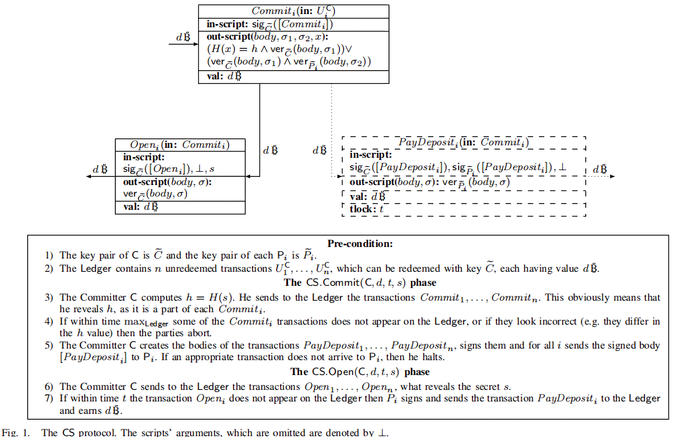

两种定时承诺实现方法的比较
==============================

论文作者的实现
----------------


* 原论文的作者主要是通过多方签名和比特币交易的lock_time属性(图中的t_lock)实现的

使用OP_CHECKSEQUENCEVERIFY和nSequence实现定时承诺
----------------------------------------------------------------------------------

通过比特币脚本的OP_CHECKSEQUENCEVERIFY操作和交易输入的nSequence字段可以实现**相对**时间的定时承诺。

注：以下内容都基于版本大于等于2的比特币交易

* OP_CHECKSEQUENCEVERIFY

  当比特币脚本运行OP_CHECKSEQUENCEVERIFY操作时，比较栈顶元素和交易输入的nSequence属性的大小。如果nSequence小于栈顶元素，那么脚本就会直接返回错误(典型情况，具体请参考 [BIP 112](https://github.com/bitcoin/bips/blob/master/bip-0112.mediawiki#Bidirectional_Payment_Channels))，否则就相当于一个空操作。
  
* nSequence

  + nSequence是交易输入的一个属性
  + nSequence是一个32位比特串
  + nSequence的作用曾经在[BIP 68](https://github.com/bitcoin/bips/blob/master/bip-0068.mediawiki#Deployment)中重新进行了定义，目前网上查到的许多博客说的是它原本的意思
  + 当nSequence的最高位设置为1时，它被认为是一个相对时间锁，这种交易只有到了相对锁定时间后才生效。具体来说，如果交易输入使用的UTXO(Unspent Transcation Output)的创建时间和当前时间的差值小于nSequence表示的时间时，这笔交易将不能被矿工开采(nSequence will be repurposed to prevent mining of a transaction until a certain age of the spent output in blocks or timespan. [BIP 68](https://github.com/bitcoin/bips/blob/master/bip-0068.mediawiki#Deployment))
  + nSequence表示的时间锁既可以基于时间(time_based)，也可以基于块的个数(block-based)
    + 比特(1<<22)决定相对锁定时间是基于时间的还是基于块数的。如果(1<<22)被置为1，那么是基于时间的，否则基于块的个数
    + A relative time-based lock-time n can be included into any block produced 512 * n seconds after the mining date of the output it is spending, or any block thereafter. ( [BIP 68](https://github.com/bitcoin/bips/blob/master/bip-0068.mediawiki#Deployment))
    + A relative block lock-time n can be included n blocks after the mining date of the output it is spending, or any block thereafter.( [BIP 68](https://github.com/bitcoin/bips/blob/master/bip-0068.mediawiki#Deployment))
    + 
  
* 定时承诺的实现

  * *Open*交易与论文作者的实现完全一致
  
  * *Commit*交易的输出脚本更改为：
    $out$-$script(body,\sigma_1,\boldsymbol{x},nSequence):$
    	$(H(\boldsymbol{x}) = h \bigwedge ver_{ \widetilde{C}}(body,\sigma_1))\bigvee(   t<nSequence \bigwedge ver_{ \widetilde{P}}(body,\sigma_2))$
    
    其中：$t$为创建输出脚本时设置的时间锁 ; $t < nSequnce$通过OP_CHECKSEQUENCEVERIFY来实现
    
    写成更简明的形式：
  
    ```
    out-script:
        if{ 
            [hashlock] 
            p2pkh 
        }
        else{ 
            [relativetimelock] 
            p2pkh 
        }
    ```
    
    
    
    
    
  * *PayDeposit*交易的输入脚本更改为：
  
    $in$-$script$:
    	$nSequence, sig_{\widetilde{P}}([PayDeposit])$
  
* 比较

  相比于作者的实现，新的实现：

  * 不涉及多方签名的交易
  * 不需要链下传输交易

Q&A
---------

* 为何作者没有使用这种实现方式？
  * 因为当时 OP_CHECKSEQUENCEVERIFY([BIP 112](https://github.com/bitcoin/bips/blob/master/bip-0112.mediawiki#Bidirectional_Payment_Channels)) 和 nSequence([BIP 68](https://github.com/bitcoin/bips/blob/master/bip-0068.mediawiki#Deployment)) 还没有被开发出来
* 如何创建使用**绝对**时间的定时承诺
  * 使用 OP_CHECKLOCKTIMEVERIFY 和 Locktime
  * 具体的方法和**相对**时间的定时承诺是类似的

